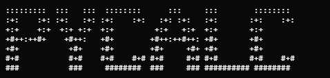

# pycalc

     [](LICENSE)

<p align="center">
  
</p>

A simple command-line calculator built with **Python** and **Lua** that evaluates both mathematical and chemical expressions directly in the terminal, designed for simplicity and ease of use.

> [!NOTE]
> This project is still under active development and is **not yet production-ready**.

## Table of Contents

* [Features](#features)
* [Installation](#installation)
* [Examples](#examples)
* [License](#license)

## Features

Below are the features currently supported. For detailed explanations, see the [Features documentation](docs/FEATURES.md).

### Core Math
* Basic Arithmetic (`+`, `-`, `*`, `/`)
* Expression Evaluation
* Calculation History
* Remainder Calculation
* Factorial
* Permutations
* Combinations

### Number Theory
* Prime Checker
* Semiprime Checker
* Prime Sequence Generator
* Semiprime Sequence Generator
* Factorization
* Least Common Multiple (LCM)
* Greatest Common Divisor (GCD)

### Fractions
* Fraction → Decimal Conversion
* Decimal → Fraction Conversion
* Convert to Proper Fraction
* Get Numerator / Denominator

### Polynomials
* Get Coefficients
* Get Terms
* Get Variables
* Determine Type by Term
* Determine Type by Degree

### Sequences & Finance
* Arithmetic Sequences
* Arithmetic Series
* Arithmetic Difference
* Interest Calculations

### Scientific Tools
- Significant Figures
  * Count
  * Convert to Proper Form
* Chemistry Support *(coming soon)*

## Installation

Follow the steps below to set up and run **Pycalc**.

> [!NOTE]
> Ensure that **Python** and **Lua** are installed before running the program.

### 1. Clone the Repository

```bash
git clone https://github.com/an0nym9/pycalc.git
cd pycalc
```

### 2. Install Dependencies Using Poetry

Make sure Poetry is installed (tested with version **2.2.1**).

```bash
poetry install
```

### 3. Run Pycalc

```bash
poetry run pycalc
```

### 4. Run Tests (Optional)

Make sure Pytest is installed (tested with version **9.0.2**).

```bash
poetry run pytest
```

## Examples

Below are a few examples of what this program can do.

### Example: Calculating the LCM of `12`, `6`, `9`, `7`, and `14`

```txt
+==================================================+
|                      Number                      |
+==================================================+
|                                                  |
|  [1] Check prime                                 |
|  [2] Check semiprime                             |
|  [3] Generate prime sequence                     |
|  [4] Generate semiprime sequence                 |
|  [5] Fraction to decimal                         |
|  [6] Decimal to fraction                         |
|  [7] Factor                                      |
| > [8] Least common multiple                      |
|  [9] Greatest common divisor                     |
|  [10] Get remainder                              |
|  [11] Fraction tools                             |
|  [12] Exit                                       |
|                                                  |
+==================================================+
How many numbers would you like to add? 5
Enter the number: 12
Enter the number: 6
Enter the number: 9
Enter the number: 7
Enter the number: 14
>> 252
Press enter to continue...
```

### Example: Converting `432 / 54` to a Proper Fraction

```txt
+==================================================+
|                Fraction Tools                    |
+==================================================+
|                                                  |
| > [1] Proper fraction                            |
|  [2] Get numerator                               |
|  [3] Get denominator                             |
|  [4] Exit                                        |
|                                                  |
+==================================================+
Enter the whole number: 0
Enter the numerator: 432
Enter the denominator: 54
>> 8
Press enter to continue...
```

## License

This project is licensed under the [MIT License](LICENSE).
