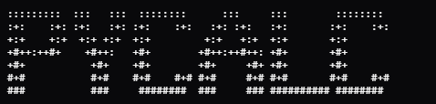

# pycalc

     [](LICENSE)



**pycalc** is a lightweight command-line calculator built with **Python** and **Lua**. It evaluates mathematical and chemical expressions directly in the terminal, with a focus on simplicity, flexibility, and extensibility.

Learn more: https://an0nym9.github.io/pycalc/

> [!WARNING]
> This project is under active development and is not production-ready.

---

## Table of Contents

- [Features](#features)
- [Installation](#installation)
- [Examples](#examples)
- [Roadmap](#roadmap)
- [Contributing](#contributing)
- [License](#license)

---

## Features

Below is an overview of the currently supported functionality. For complete details, refer to the [Features documentation](docs/FEATURES.md).

### Core Mathematics
- Perform basic arithmetic operations (`+`, `-`, `*`, `/`)
- Evaluate mathematical expressions
- Track and review calculation history
- Compute remainders
- Calculate factorials
- Solve permutations and combinations

### Number Theory
- Check for prime and semiprime numbers
- Generate prime and semiprime sequences
- Perform integer factorization
- Compute Greatest Common Divisor (GCD)
- Compute Least Common Multiple (LCM)

### Fractions
- Convert fractions to decimals
- Convert decimals to fractions
- Format proper fractions
- Extract numerators and denominators

### Polynomials
- Extract coefficients, terms, and variables
- Classify by number of terms (e.g., monomial, binomial)
- Classify by degree

### Sequences and Finance
- Analyze arithmetic sequences and series
- Calculate common differences
- Perform basic interest calculations

### Scientific Tools

#### Significant Figures
- Count significant figures
- Format values to the correct number of significant figures

#### Chemistry Utilities
- Validate chemical elements
- Identify diatomic elements
- Determine valence
- Classify ion types
- Retrieve element group and period

---

## Installation

Follow the steps below to install and run **pycalc**.

> [!NOTE]
> Make sure both Python and Lua are installed on your system before you begin.

### 1. Clone the repository
```bash
git clone https://github.com/an0nym9/pycalc.git
cd pycalc
```

2. Install dependencies
```bash
poetry install
```

3. Run the application
```bash
poetry run pycalc
```

4. Run tests (optional)
```bash
poetry run pytest
```

---

## Examples

Below are a few examples of what this program can do.

### Example: Calculating the LCM of `12`, `6`, `9`, `7`, and `14`

```txt
+==================================================+
|                      Number                      |
+==================================================+
|                                                  |
|  [1] Check prime                                 |
|  [2] Check semiprime                             |
|  [3] Generate prime sequence                     |
|  [4] Generate semiprime sequence                 |
|  [5] Fraction to decimal                         |
|  [6] Decimal to fraction                         |
|  [7] Factor                                      |
| > [8] Least common multiple                      |
|  [9] Greatest common divisor                     |
|  [10] Get remainder                              |
|  [11] Fraction tools                             |
|  [12] Exit                                       |
|                                                  |
+==================================================+
How many numbers would you like to add? 5
Enter the number: 12
Enter the number: 6
Enter the number: 9
Enter the number: 7
Enter the number: 14
>> 252
Press enter to continue...
```

### Example: Converting `432 / 54` to a Proper Fraction

```txt
+==================================================+
|                Fraction Tools                    |
+==================================================+
|                                                  |
| > [1] Proper fraction                            |
|  [2] Get numerator                               |
|  [3] Get denominator                             |
|  [4] Exit                                        |
|                                                  |
+==================================================+
Enter the whole number: 0
Enter the numerator: 432
Enter the denominator: 54
>> 8
Press enter to continue...
```

## License

This project is licensed under the [MIT License](LICENSE).
